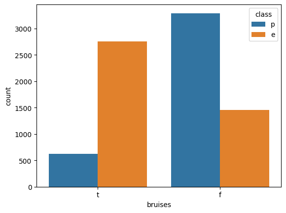
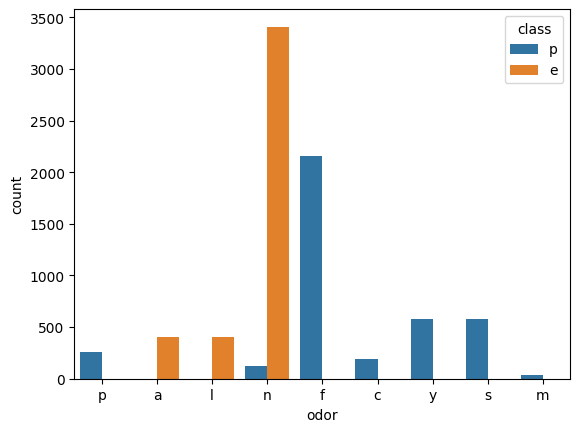
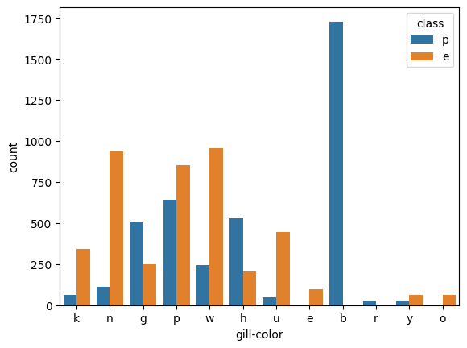
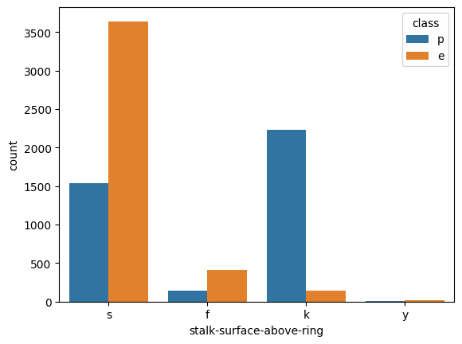
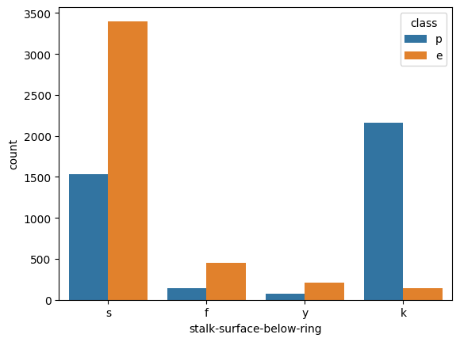
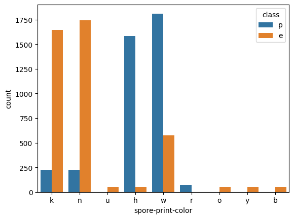
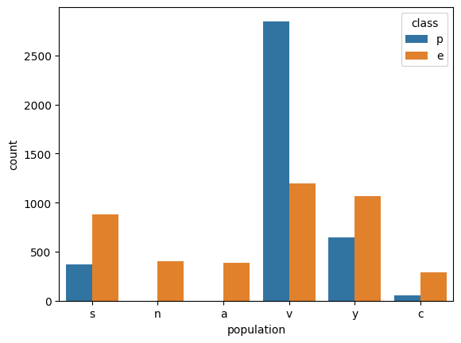
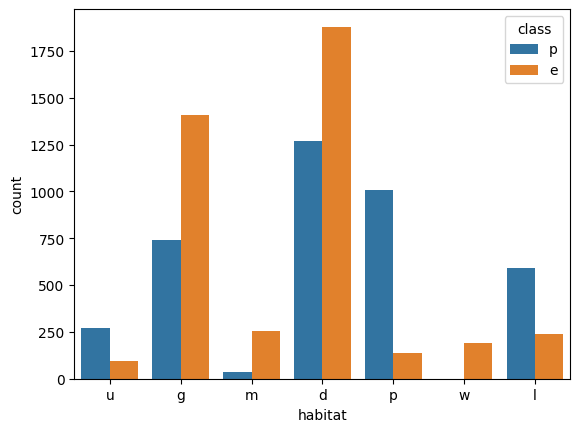

# algoritm_fungi
algoritmo de hongos venenosos/comestibles

## DESCRIPCION PROYECTO

Este database está enfocado en la detección de carpóforos venenosos o no venenosos a través de caracteristicas físicas (visuales).

Las columnas está caracterizadas de la siguiente forma:

"Caracteristica primordial -> Attribute Information: (classes: edible= e, poisonous= p)"
- edible = comestible; poisonous = venenoso

**1.-** Cap-shape: bell=b, conical=c, convex=x, flat=f, knobbed=k, sunken=s
- Forma sombrero: campana = b, conica = c, convexa = x, plana = f, c/nódulo = k, hundida = s; Categoría nominal (object/category) 
- En la primera gráfica, no parece ser un dato relevante para saber si el hongo es venenoso o no. (gráfica eliminada)

**2.-** Cap-surface: fibrous=f, grooves=g, scaly=y, smooth=s
- Superficie del sombrero: fibrosa = f, surcos = g, escamosa = y, lisa = s; Categoría nominal (object/category).
- En una gráfica comparativa de superficie del sombrero con la clase, no es un dato relevante parasaber si es venenoso o no. (gráfica eliminada).

**3.-** Cap-color: brown=n, buff=b, cinnamon=c, gray=g, green=r, pink=p, purple=u, red=e, white=w, yellow=y
- Color del sombrero: marrón = n, crema = b, canela = c, gris = g, verde = r, rosa = p, morado = u, rojo = e, 
blanco = w, amarillo = y; Categoría nominal (object/category)

sns.countplot(data=datos_f_copia, x='cap-color', hue='class')
- En esta fráfica comparativa con clase, no es un dato relevante para saber si es venenoso o no. (gráfica eliminada).
 
**4.-** Bruises: bruises=t,no=f
- Manchas: Si = t, No = f; 

**sns.countplot(data=datos_f_copia, x='bruises', hue='class')**

- Esta gráfica señala datos significativos y caracteristicos para señalar que podrían servir para indicar si el hongo es venenoso o no. 

**5.-** Odor: almond=a, anise=l, creosote=c, fishy=y, foul=f, musty=m, none=n, pungent=p, spicy=s
Olor: almendras = a, anis = l, alquitrán = c, pescado = y, fétido = f, moho = m, ninguno = n, penetrante = p, especiado = s; Categoría nominal (object/category).

**sns.countplot(data=datos_f_copia, x='odor', hue='class')**

- Este dato es importantísimo para relacionarlo con venenoso o comestible. 

**6.-** Gill-attachment: attached=a, descending=d, free=f, notched=n
- Unión lamelas: adherida = a, descendente = d, libre = f, entallada = n; Categoría nominal (object/category).

- dato nada relevante para conocer toxicidad. (se elimina la gráfica)

**7.-** Gill-spacing: close=c, crowded=w, distant=d
- Espacio lamelas: cerrado = c, .apretado = w, separado = d; Categoría nominal (object/category).
- No es un dato relevante para diferenciar comestible de venenoso. (elimina gráfica)

**8.-** Gill-size: broad=b, narrow=n
- Tamaño lamelas: anchas = b, estrechas = n; Categoría nominal (object/category).
- Muchas de las setas venenosas tienen las lamelas anchas, pero un porcentaje muy alto las tiene estrechas. Es una caracteristica muy buena para diferenciar comestibles. no se tomará este dato, pero se conserva gráfica. 

**9.-** Gill-color: black=k, brown=n, buff=b, chocolate=h, gray=g, green=r, orange=o, pink=p, purple=u, red=e, white=w,yellow=y
- Color de lamelas: negro = k, crema = b, chocolate = h, gray = g, verde = r, naranjo = o, rosado = p, morado = u
rojo = e, blanco = w, amarillo = y; Categoría nominal (object/category). 

**sns.countplot(data=datos_f_copia, x='gill-color', hue='class')**

- Es una dato que señala que un porcentaje bastante alto de setas venenosas tiene una coloración de lamelas color crema (aprox. 60%), por lo que esta gráfica es interesante.

**10.-** Stalk-shape: enlarging=e, tapering=t
- Forma del pie: ensanchado = e, estrechado = t; Categoría nominal (object/category).
- Este dato no es relevante para conocer si el hongo es venenoso o no. (gráfica eliminada).

**11.-** Stalk-root: bulbous=b, club=c, cup=u, equal=e, rhizomorphs=z, rooted=r, missing=?
- Base de pie: bulboso = b, maza = c, copa = u, igual = e, rizomorfo = z, enraizado = r, carente =?; 
Categoría nominal (object/category).
- Este dato, no es del todo relevante, debido a que el dato "carente", sería el significativo. (elimina gráfica)

**12.-** Stalk-surface-above-ring: fibrous=f, scaly=y, silky=k, smooth=s
- Superficie del pie sobre el anillo: fibrosa = f, escamosa = y, sedosa = k, lisa = s; 
Categoría nominal (object/category). 

**sns.countplot(data=datos_f_copia, x= 'stalk-surface-above-ring', hue='class')**

- Este dato, es relevante para una caracteristica, "K", en un porcentaje importante las setas son sedosas entre sobrero y anillo. (se tomará gráfica).

**13.-** Stalk-surface-below-ring: fibrous=f, scaly=y, silky=k, smooth=s
- Superficie del pie bajo el anillo: fibrosa = f, escamosa = y, sedosa = k, lisa = s; 
Categoría nominal (object/category).

**sns.countplot(data=datos_f_copia, x='stalk-surface-below-ring', hue='class')**

- Bajo el anillo el pie tambien es sedoso, caracteristica muy representativa en especies venenosas. 

**14.-** Stalk-color-above-ring: brown=n, buff=b, cinnamon=c, gray=g, orange=o, pink=p, red=e, white=w, yellow=y
- Color del pie sobre el anillo: marrón = n, beige = b, canela = c, gris = g, naranja = o, rosa = p, rojo = e, 
blanco = w, amarillo = y; Categoría nominal (object/category).
- No es un dato muy diferenciador... casi igual al 15. (elimina ambas gráficas)

**15.-** Stalk-color-below-ring: brown=n, buff=b, cinnamon=c, gray=g, orange=o, pink=p, red=e, white=w, yellow=y
- Color del pie bajo el anillo: marrón = n, beige = b, canela = c, gris = g, naranja = o, rosa = p, rojo = e, 
blanco = w, amarillo = y; Categoría nominal (object/category)

**16.-** Veil-type: partial=p, universal=u
- Tipo de velo: parcial = p, universal = u; Categoría nominal (object/category).
- dato eliminado 100% de hongos tienen velo parcial. 

**17.-** Veil-color: brown=n, orange=o, white=w, yellow=y
- Color del velo: marrón = n, naranja = o, blanco = w, amarillo = y; Categoría nominal (object/category).
- Caracteristica nada interesante, ya que tanto hongos comestibles como venenosos son blancos en su mayoría. (gráfica eliminada).

**18.-** Ring-number: none=n, one=o, two=t
- Número de anillos: ninguno = n, uno = o, dos = t; Categoría nominal (object/category).
- Dato nada relavante para diferenciar si el hongo es venenoso o comestible, Aunque se aprecia que un pequeño porcentaje de hongos venenosos no tienen anillos. (eliminar gráfica momentáneamente) 

**19.-** Ring-type: cobwebby=c, evanescent=e, flaring=f, large=l, none=n, pendant=p, sheathing=s, zone=z
- Tipo de anillo: telaraña = c, evanescente = e, acampanado = f, grande = l, ninguno = n, colgante = p, 
envainador = s, zona = z; Categoría nominal (object/category).
- Sólo hongos venenosos tienen la caracteristica de anillo grande "L". Se dejará como medianamente interesante. (se conserva gráfica).

**20.-** Spore-print-color: black=k, brown=n, buff=b, chocolate=h, green=r, orange=o, purple=u, white=w, yellow=y
- Color de la esporada: negro = k, marrón = n, beige = b, chocolate = h, verde = r, naranja = o, morado = u, 
blanco = w, amarillo = y; Categoría nominal (object/category).

**sns.countplot(data=datos_f_copia, x='spore-print-color', hue='class')**

- Dato muy relevante, señala una diferencia importante en la coloración de las esporas de hongos comestibles y venenosos. 

**21.-** Population: abundant=a, clustered=c, numerous=n, scattered=s, several=v, solitary=y
- Población: abundante = a, agrupada = c, numerosa = n, dispersa = s, varias = v, solitaria = y; 
Categoría nominal (object/category).

**sns.countplot(data=datos_f_copia, x='population', hue='class')**

- Dato interesante, ya que señala que un alto porcentaje de hongos venenosos crecen de forma no agrupada pero se encuentran en gran cantidad en un espacio determinado (gráfica añadida).

**22.-** Habitat: grasses=g, leaves=l, meadows=m, paths=p, urban=u, waste=w, woods=d
- Hábitat: pastos = g, hojas = l, prados = m, senderos = p, urbano = u, residuos = w, bosques = d; 
Categoría nominal (object/category).

**sns.countplot(data=datos_f_copia, x='habitat', hue='class')**

- Datos que señalan que los hongos venenosos se encuentran en grán cantidad entre sendeerosy hojarasca. En estas áreas son predominantes. (gráfica añadida).

## CARACTERISTICAS DATASET

Base de datos que señala una serie de caracteristicas físicas para la identificación de carpóforos a través de diversas descripciones. 

@@ Para saber la importancia de cada una de mis variables, primero debo saber cúal me dá caracteristicas de identificación más precisas. Por ejemplo si una columna me señala un 90% de color de sombrero amarillo, esa columna no es muy beneficiosa a la hora de identificar si una especie es venenosa o no. De esta forma veremos cómo están repartidos los datos dentro de mi columna. 

Para ello debo hacer: sns.countplot(data=df, x='nombre_columna')

@@ Ahora lo segundo es saber: que característica física está más relacionada con un carpóforo venenoso, siendo ésta una variable casi fundamental!

Para este paso habría que incorporar un parámetro (hue), con el siguiente código:

sns.countplot(data=datos_f_copia, x='columna*', hue='class', 
            order=datos_f_copia['columna*'].value_counts().index)
plt.xticks(rotation=45)

* He resumido estas gráficas con: **sns.countplot(data=datos_f_copia, x='columna1', hue='class')**

* columna que quiero comparar con la clase que es venenoso o comestible.

print(/n/)

Datos que son relevantes de acuerdo a gráficas:

1) 1.- clase (mi columna objetivo)
2) 4.- Manchas 
3) 5.- olor (detectora)
4) 9.- color lamelas (útil para descartar)
5) 12 y 13, superficie pie sobre y bajo anillo medianamente relevante. se podrían unir estos datos haciendo 1 sóla columna.
6) se ha unido la columna 14 y 15, con datos de color pie antes y después de anillo.
7) 18.- sólo hongos venenosos no tienen anillo, medianamente interesante.
8) 19.- Sólo hongos venenosos tienen anillo L, medianamente interesante. 
9) 20.- Color de la esporada (detector)
10) 21.- Población
11) 22.- Hábitat

## PASOS A SEGUIR

1.- unificar columnas 12 y 13, ya que los datos son similares y tienen un grado de importancia. Como sólo 1 valor en esta columna es interesante y es precisamente el valor k (sedoso), para hongos venenosos, por lo que este valor será true y todo el resto de valores será false. 

# Crea una columna que es True si cualquiera de las dos es 'k'
df['pie_sedoso'] = (df['stalk-surface-above-ring'] == 'k') | (df['stalk-surface-below-ring'] == 'k').

2.- He realizado una unificación de las columnas 14 y 15. Estas estan relacionadas con el color bajo y sobre el anillo, teniendo como caracteristicas únicas para hongos venenosos 3 colores especificos. 

He añadido el siguiente código:
colors_stalk_ring = ['b', 'c', 'y'] 

# Creamos una columna que diga "Peligro" si ese color aparece en cualquiera de los dos tramos del pie
datos_f_copia['color_alerta_veneno'] = (datos_f_copia['stalk-color-above-ring'].isin(colors_stalk_ring)) | \
                            (datos_f_copia['stalk-color-below-ring'].isin(colors_stalk_ring))

# Convertimos a 1 (Peligro, poisonous) y 0 (Normal)
datos_f_copia['color_alerta_veneno'] = datos_f_copia['color_alerta_veneno'].astype(int)

Ahora bien, esta columna se convierte en un excelente indicador de "venenoso", pero no de comestible, ya que hay hongos venenosos y comestibles que comparten la misma coloración de pie bajo y sobre anillo. 

https://www.kaggle.com/code/nethanael/hongos-clasificacion/input

# Vamos a ver la precisión de tu nueva variable. Esto tiene como objetivo simplemente saber si la columna creada con las columnas 14 y 15, realmente me predice que al menos el 2% de los hongos será si o si, venenoso, de acuerdo al color del pie. (Esto cuando tenga velo)
De esta forma puedo agrupar mi columna en montones, en este caso los "e" y los "p".

counts = datos_f_copia.groupby('color_pie_alerta_veneno')['class'].value_counts(normalize=True) * 100
print(counts)

## LABEL ENCODERING

1.- copia limpia para comenzar el machine learning

2.- Arbol de decisión que entrega un porcentaje de aprendizaje del 99,94%

